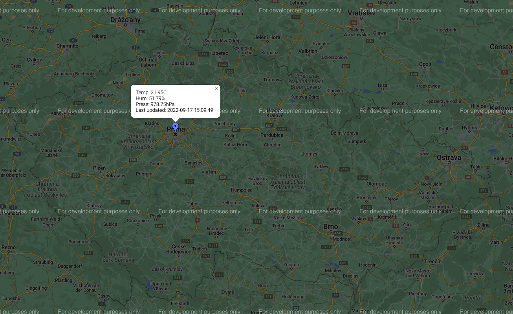

# Apache Kafka at the Edge

This repository contains my demo of [Apache Kafka®](https://kafka.apache.org/) running at the edge.
The demo shows how you can run Kubernetes with [Strimzi](https://strimzi.io/) based Apache Kafka cluster at the edge.
This clusters collects data from sensor devices running locally and does local processing.
The processed data are synced into the central Kafka cluster where they are collected and aggregated from multiple different edge locations.

## Slides

TODO: Slides do not yet exist.

## IoT Sensors

The code for the IoT device with sensors is in the [`esp32` directory](./esp32).
In my case, the IoT device is the LOLIN32 Lite board with the BME280 sensor for temperature, humidity and atmospheric pressure.
It is written for my particular device, but it should in general be compatible with other ESP32 boards as well.

The application is written using [MicroPython](https://micropython.org/) and does the following:
* Connects to the WiFi
* Syncs the time from the NTP servers
* Periodically (every 5 seconds) collects the data from the sensors, formats them to JSON, and pushes them using HTTP to the Strimzi Kafka Bridge.

The [Strimzi Kafka Bridge](https://github.com/strimzi/strimzi-kafka-bridge) forwards it to the local Apache Kafka cluster where the data are stored and processed.

The JSON message looks like this:
```json
{
    "temperature": "20.57C",
    "timestamp": "2022-09-17 18:48:56",
    "longitude": 14.4378,
    "humidity": "54.87%",
    "pressure": "981.59hPa",
    "latitude": 50.0755
}
```

The `latitude` and `longitude` is the location of the sensor used to show it on the map.
The `timestamp` is the time when the data were taken.
And the remaining fields are taken from the sensor.

## Edge cluster

TODO: Not done yet

## HQ cluster

The HQ cluster is the central cluster that collects the data form all the different edge locations and aggregates them.
Currently, the HQ has a _frontend_ application that displays the data from the sensors on a map.

### Frontend

The _frontend_ is a [Quarkus](https://quarkus.io/) based application that serves a website and an API.
The Quarkus backend connects to Kafka, gets the data from the sensors and serves them through an REST API.
The website is based on a [Google Charts](https://developers.google.com/chart/interactive/docs/gallery/map) based map.
It gets the sensor data from the REST API and shows them on the map.



_Note: If you want to get rid of the `For developer purposes only` message, you have to register for an API key._
_For more details about getting the API key, see: https://developers.google.com/chart/interactive/docs/basic_load_libs#load-settings_
